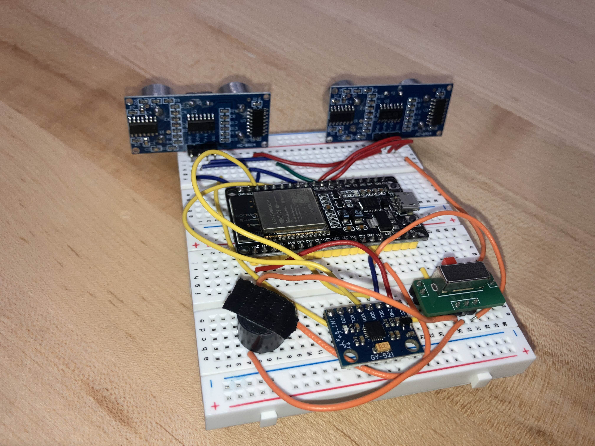
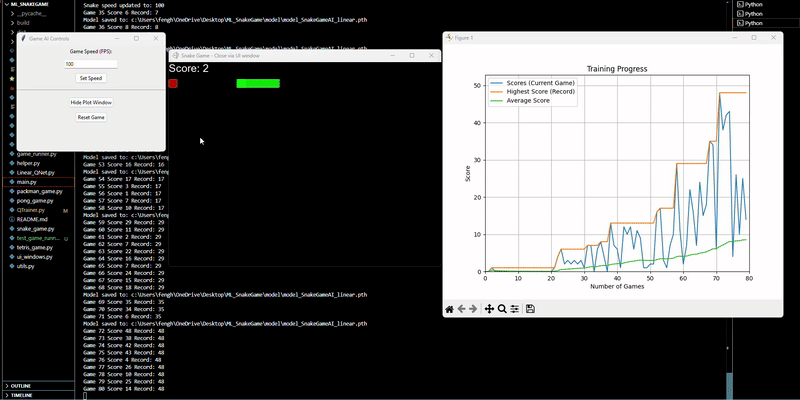

Peter Feng

 **Computer Engineering Student | Embedded Systems | PCB design | Design and Verification**  
Passionate about solving problems efficiently and building intelligent systems.  
I envision creating **digital twin** replicas of real-world structures to monitor, simulate, and optimize performance — powered by platforms like *Nvidia Omniverse*.  

---

## 🚀 Featured Projects

### Obstacles and Fall Detection Wearable 
*A embedded wearable device with ultra sonic sensors and IMU actively monitor owner's activity and transfer data to family member's dashboard. *  

- Dual Ultra Sonic Sensor calibration for obstacles detection. 
- Active Buzzer that alert when get too close. 
- Tiny GY521 IMU that takes accurate data and reflect on dashboard.  
- AI algorithm that dynamically accurately predict the falling sequence. 

**Tech Stack:** C, python, frontend, backend, esp32. 
📂 [View Repository](https://github.com/PETERFEE/SAVE_YOUR_GRANDPA)

---

### ⏰ VHDL Digital Alarm Clock (Basys3 FPGA)
*A 24-hour digital alarm clock built with VHDL for the Digilent Basys3 Artix-7 FPGA board.*  

- Large 7-segment display for time  
- Simple slide-switch controls for setting time & alarm  
- Flashing LED alarm indicator  
- Reset and alarm silence functions  

**Tech Stack:** VHDL, Vivado HLx, FPGA Design  
📂 [View Repository](https://github.com/PETERFEE/Basys3-Alarm-Clock)

---

### 🧠 IPInvest — Decentralized IP Tokenization Platform
*A blockchain-powered marketplace for intellectual property investments.*  

- **Fractional Ownership:** 1000 tokens per idea for micro-investments  
- **AI Valuation Model:** Predicts IP value using Random Forest  
- **RL Recommender:** Optimizes investment portfolios with PPO  
- **Smart Contracts:** Built with CosmWasm for automated royalty distribution  

**Tech Stack:** Python (Flask, ML), Rust (CosmWasm), SQLite, Andromeda Blockchain  
📂 [View Repository](https://github.com/PETERFEE/Hackthon_BlockChain)

---
### 🎮 ML Game Trainer
*A multi-game machine learning training platform with AI agents.*  

- **Games Included:** Snake, Pong, Flappy Bird, Tetris, Galaga, Dino Run, Pacman  
- **AI Training:** Deep Q-Learning with Linear & CNN models  
- **Features:**  
  - Real-time training visualization with `matplotlib`  
  - Adjustable training speed  
  - Model persistence (`.pth` saving/loading)  
  - Tkinter-based game selection UI  

**Tech Stack:** Python, Pygame, PyTorch, Tkinter, Matplotlib  
📂 [View Repository](https://github.com/PETERFEE/ML_Game_Trainer)

---

### 💣 Minesweeper (C++ & SFML)
*A fully-featured Minesweeper game with a leaderboard and configurable board sizes.*  

- Welcome screen with player name input  
- Adjustable board & mine count via `config.cfg`  
- Debug mode & pause/play functionality  
- Leaderboard for top 5 fastest times  

**Tech Stack:** C++, SFML  
📂 [View Repository](https://github.com/PETERFEE/Sweep-the-Mines)

## 📬 Contact
Phone Number : (469)826-2067
📧 Email: [fenghon000@gmail.com](mailto:fenghon000@gmail.com)  
💼 LinkedIn: [peterfeng718](https://www.linkedin.com/in/peterfeng718/)  

---

> *Built with ❤️ to connect Machine Learning and hardware in real-world solutions.*
